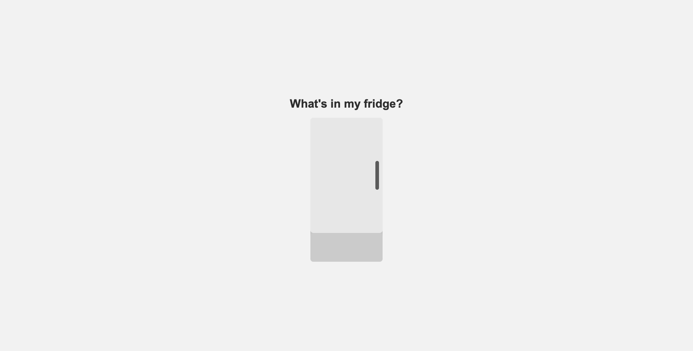
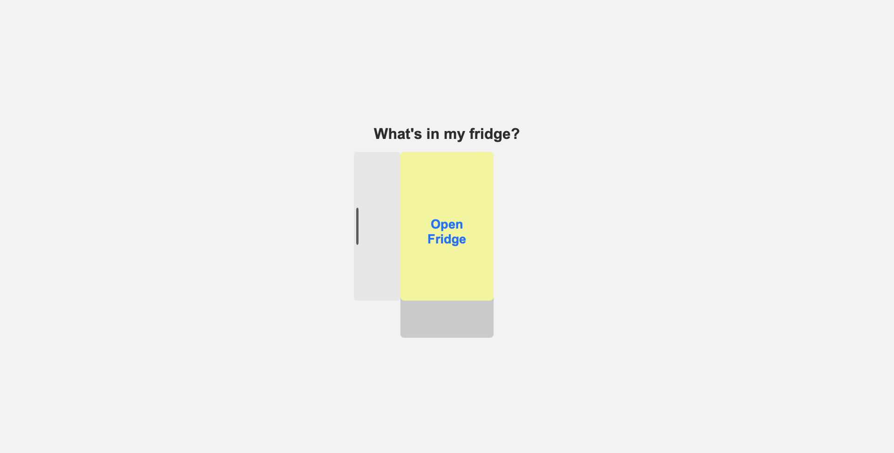
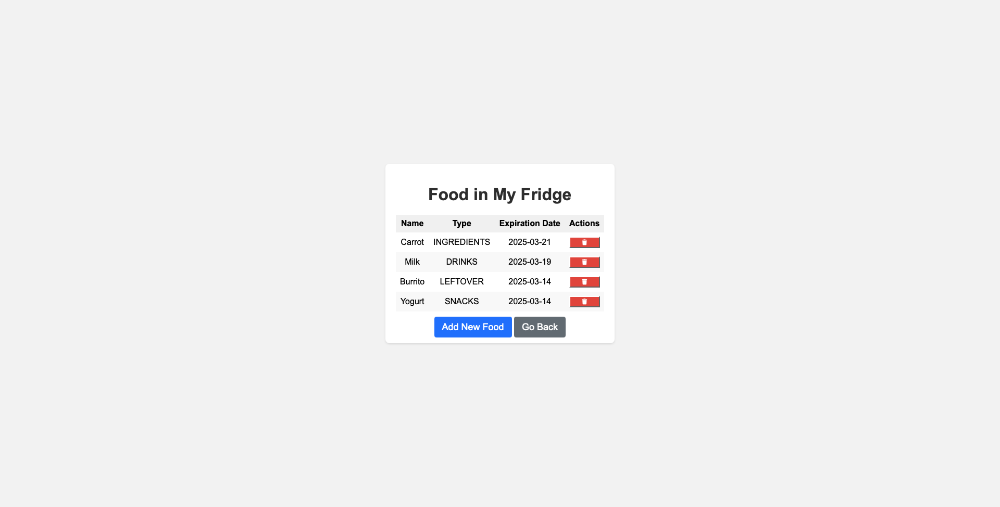
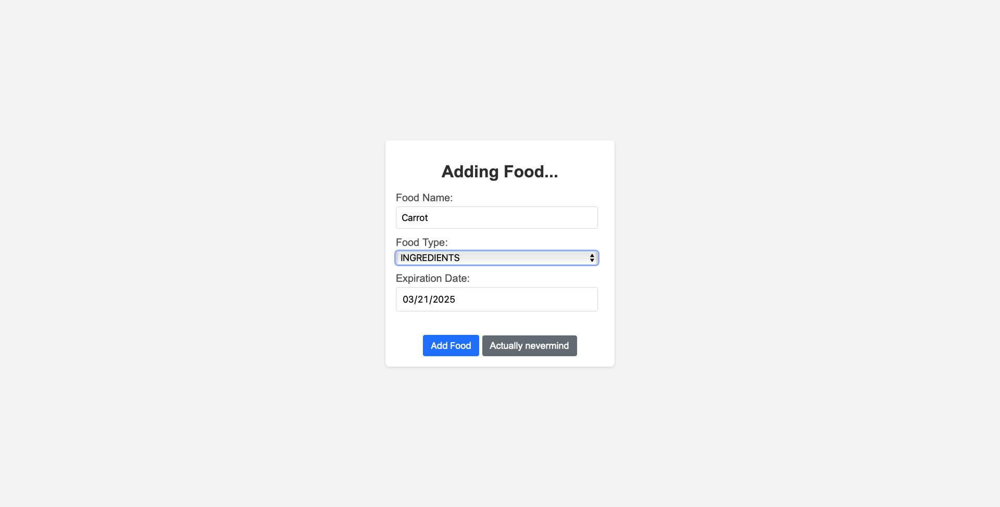

# My Fridge

**My Fridge** is a web application that helps user track the food items in their fridge. It allows users to add, view, update, and delete foot items, including their names, types, and expiration date.

## Features

- **View all food items** in the fridge with their details (name, type, and expiration date).
- **Add new food items** to the fridge.
- **Update existing food items**.
- **Delete food items**.
- Simple, user-friendly interface using **Spring Boot** and **Thymeleaf**.

## Technology Stack

- **Java (JDK 17)** - The backend of the application is built using Java.
- **Spring Boot 3.4.3** - Backend framework used for the app.
- **Spring Data JPA** - For database interaction.
- **MySQL** - Database for storing food items.
- **Thymeleaf** - Templating engine for rendering HTML views.
- **CSS** - For styling the frontend.

## Getting Started

### Prerequisites

Make sure you have the following installed:

- [Java 11 or higher](https://adoptopenjdk.net/)
- [Maven](https://maven.apache.org/) (or use the Maven wrapper)
- [MySQL](https://dev.mysql.com/downloads/installer/)
- An IDE like [IntelliJ IDEA](https://www.jetbrains.com/idea/) or [Eclipse](https://www.eclipse.org/)

### Clone the repository

```bash
  git clone https://github.com/yourusername/myfridge.git
  cd myfridge
```
### Setup the Database

1. **Create a MySQL Database**
    - Create a new database named `myfridge` in MySQL.

2. **Configure Database Connection**
    - Create a application.properties file at `src/main/resources/`.
    - Configure the `spring.datasource` settings to connect to your database:

   ```properties
   spring.datasource.url=jdbc:mysql://localhost:3306/myfridge
   spring.datasource.username=root
   spring.datasource.password=yourpassword
   spring.datasource.driver-class-name=com.mysql.cj.jdbc.Driver
   spring.jpa.hibernate.ddl-auto=update
   spring.jpa.database-platform=org.hibernate.dialect.MySQL5InnoDBDialect
   ```
    - Replace yourpassword with your actual MySQL password.

### Running the Project

1. **Build the Project**
   - Run the following command to build the project:

    ```bash
    mvn clean install
    ```

2. **Run the Application**
    - You can run the Spring Boot application using:
    ```bash
    mvn spring-boot:run
    ```   

3. **Access the Application**
    - Once the application is running, navigate to the following URL in your browser:
    ```angular2html
    http://localhost:8080/fridge-items
    ```
## Screenshots
Here are some previews of MyFridge in action:
- The homepage to open the fridge.  


- Food list page the user can see all of their food in the fridge.

- Add Food page where the user can add food.

